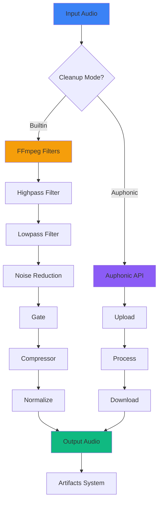

# Audio Cleanup Documentation

Comprehensive audio enhancement and cleanup module for Video Studio.

## Overview

The Audio Cleanup module provides two cleanup modes:
- **Built-in AI Cleanup**: Fast, ffmpeg-based processing
- **Auphonic API**: Professional-grade audio enhancement

Both modes remove noise, echo, breaths, and normalize volume levels.

---

## Architecture



---

## API Reference

### AudioCleanup Class

```python
from processors.audio_cleanup import AudioCleanup

# Built-in cleanup (fast)
cleanup = AudioCleanup(mode='builtin')

# Auphonic cleanup (professional)
cleanup = AudioCleanup(
    mode='auphonic',
    auphonic_api_key='your-api-key'
)
```

#### Constructor Parameters

| Parameter | Type | Default | Description |
|-----------|------|---------|-------------|
| `mode` | str | `'builtin'` | Cleanup mode: `'builtin'` or `'auphonic'` |
| `auphonic_api_key` | str | None | Auphonic API key (required for `auphonic` mode) |

---

### cleanup() Method

Main method for audio cleanup processing.

```python
output_path = cleanup.cleanup(
    input_path='audio.wav',
    output_path='audio_cleaned.wav',
    preset='medium',
    custom_params={'nr_amount': 7},
    progress_callback=lambda p: print(f"{p*100}%")
)
```

#### Parameters

| Parameter | Type | Default | Description |
|-----------|------|---------|-------------|
| `input_path` | str | Required | Path to input audio file |
| `output_path` | str | None | Path for output (auto-generated if None) |
| `preset` | str | `'medium'` | Cleanup preset name |
| `custom_params` | dict | None | Custom parameters (overrides preset) |
| `progress_callback` | callable | None | Progress callback function (0.0 to 1.0) |

#### Returns

`str` - Path to cleaned audio file

---

## Built-in Mode

### Presets

#### Light
Fast cleanup with minimal processing:
- Highpass: 80 Hz
- Lowpass: 12000 Hz
- Noise reduction: 3/10
- Gate: -40 dB
- Normalize: -16 LUFS

```python
cleanup.cleanup('audio.wav', preset='light')
```

#### Medium (Default)
Balanced cleanup for most use cases:
- Highpass: 100 Hz
- Lowpass: 10000 Hz
- Noise reduction: 5/10
- Gate: -35 dB
- Normalize: -16 LUFS

```python
cleanup.cleanup('audio.wav', preset='medium')
```

#### Aggressive
Maximum noise removal:
- Highpass: 120 Hz
- Lowpass: 8000 Hz
- Noise reduction: 8/10
- Gate: -30 dB
- Normalize: -14 LUFS

```python
cleanup.cleanup('audio.wav', preset='aggressive')
```

### Custom Parameters

Override preset parameters:

```python
custom = {
    'highpass': 150,      # Hz
    'lowpass': 9000,      # Hz
    'nr_amount': 7,       # 1-10 strength
    'gate': -32,          # dB threshold
    'compressor': True,   # Enable compression
    'normalize': -14      # Target LUFS
}

cleanup.cleanup('audio.wav', custom_params=custom)
```

### FFmpeg Filter Chain

The built-in mode uses the following ffmpeg filters:

1. **Highpass**: Remove low-frequency rumble
2. **Lowpass**: Remove high-frequency hiss
3. **afftdn**: AI-based noise reduction
4. **agate**: Silence removal
5. **acompressor**: Dynamic range compression
6. **loudnorm**: Loudness normalization (EBU R128)

---

## Auphonic Mode

Professional audio enhancement via [Auphonic API](https://auphonic.com/).

### Setup

1. Create Auphonic account: https://auphonic.com/
2. Get API key: https://auphonic.com/account/api
3. Set environment variable or pass to constructor:

```bash
export AUPHONIC_API_KEY="your-api-key"
```

### Presets

#### Podcast
Optimized for podcast/speech content:
- Denoise: Yes
- Loudness normalization: Yes
- Leveler: Yes
- Filtering: Yes

```python
cleanup = AudioCleanup(mode='auphonic')
cleanup.cleanup('podcast.wav', preset='podcast')
```

#### Video
Optimized for video narration:
- Denoise: Yes
- Loudness normalization: Yes
- Leveler: Yes
- Filtering: Yes
- Ducking: No

```python
cleanup.cleanup('narration.wav', preset='video')
```

#### Speech
Optimized for speech clarity:
- Denoise: Yes
- Loudness normalization: Yes
- Filtering: Yes
- Hipfilter: Yes (remove hum)

```python
cleanup.cleanup('speech.wav', preset='speech')
```

### Processing Flow

1. Create production on Auphonic servers
2. Upload audio file
3. Start processing
4. Poll for completion (max 10 minutes)
5. Download cleaned audio

### API Limits

Free tier: 2 hours/month
Paid plans: https://auphonic.com/pricing

---

## CLI Usage

Standalone command-line interface:

```bash
# Built-in cleanup (default)
python -m src.processors.audio_cleanup input.wav

# Specify output
python -m src.processors.audio_cleanup input.wav -o output.wav

# Choose preset
python -m src.processors.audio_cleanup input.wav -p aggressive

# Auphonic mode
python -m src.processors.audio_cleanup input.wav \
  -m auphonic \
  -p podcast \
  --auphonic-key YOUR_API_KEY
```

### CLI Arguments

| Argument | Description |
|----------|-------------|
| `input` | Input audio file path |
| `-o, --output` | Output audio file path |
| `-m, --mode` | Cleanup mode: `builtin` or `auphonic` |
| `-p, --preset` | Cleanup preset name |
| `--auphonic-key` | Auphonic API key |

---

## Integration with Artifacts

The Audio Cleanup module integrates with the Artifacts System:

```python
from core.artifacts import ArtifactsManager
from processors.audio_cleanup import AudioCleanup

# Initialize
artifacts = ArtifactsManager(project_dir='my_project')
cleanup = AudioCleanup(mode='builtin')

# Load raw audio
raw_audio = artifacts.get('raw_audio')

# Cleanup
cleaned_path = cleanup.cleanup(
    input_path=raw_audio,
    preset='medium'
)

# Save to artifacts
artifacts.save(
    'cleaned_audio',
    cleaned_path,
    metadata={
        'mode': 'builtin',
        'preset': 'medium',
        'original': raw_audio
    }
)
```

---

## Progress Tracking

Monitor cleanup progress with callbacks:

```python
def progress_handler(progress: float):
    """
    Args:
        progress: Float from 0.0 to 1.0
    """
    print(f"Progress: {progress*100:.1f}%")

cleanup.cleanup(
    'audio.wav',
    progress_callback=progress_handler
)
```

### Progress Events

**Built-in mode:**
- `0.1` - ffmpeg started
- `1.0` - Complete

**Auphonic mode:**
- `0.1` - Upload started
- `0.2` - Production created
- `0.4` - File uploaded
- `0.5` - Processing started
- `0.5-0.9` - Processing progress
- `0.9` - Processing complete
- `1.0` - Download complete

---

## Error Handling

### Common Errors

#### FileNotFoundError
Input file doesn't exist:

```python
try:
    cleanup.cleanup('nonexistent.wav')
except FileNotFoundError as e:
    print(f"File not found: {e}")
```

#### RuntimeError (ffmpeg)
ffmpeg processing failed:

```python
try:
    cleanup.cleanup('corrupt.wav')
except RuntimeError as e:
    print(f"ffmpeg error: {e}")
```

#### TimeoutError (Auphonic)
Auphonic processing timeout (>10 minutes):

```python
try:
    cleanup.cleanup('long_audio.wav', mode='auphonic')
except TimeoutError as e:
    print(f"Timeout: {e}")
```

#### ValueError
Invalid mode or missing API key:

```python
try:
    cleanup = AudioCleanup(mode='auphonic')
except ValueError as e:
    print(f"Missing API key: {e}")
```

---

## Performance

### Built-in Mode

| Duration | Processing Time | Quality |
|----------|----------------|---------|
| 1 minute | ~5 seconds | Good |
| 10 minutes | ~30 seconds | Good |
| 1 hour | ~3 minutes | Good |

**Pros:**
- Fast processing
- No API limits
- Offline capable
- Free

**Cons:**
- Lower quality than Auphonic
- Limited algorithms

### Auphonic Mode

| Duration | Processing Time | Quality |
|----------|----------------|---------|
| 1 minute | ~30 seconds | Excellent |
| 10 minutes | ~2 minutes | Excellent |
| 1 hour | ~10 minutes | Excellent |

**Pros:**
- Professional quality
- Advanced algorithms
- Automatic mastering

**Cons:**
- Requires internet
- API quota limits
- Slower than built-in

---

## Best Practices

1. **Choose the right mode:**
   - Built-in: Quick tests, offline work
   - Auphonic: Final production, professional quality

2. **Start with presets:**
   - Don't customize until you know what you need
   - Test all presets first

3. **Use progress callbacks:**
   - Show UI feedback during long operations
   - Prevent blocking the main thread

4. **Keep originals:**
   - Always save raw audio to artifacts
   - Cleanup is destructive - can't undo

5. **Monitor API usage:**
   - Check Auphonic quota before batch processing
   - Consider built-in mode for high volume

---

## Troubleshooting

### ffmpeg Not Found

**Error:** `FileNotFoundError: ffmpeg`

**Solution:**
```bash
# Ubuntu/Debian
sudo apt install ffmpeg

# macOS
brew install ffmpeg

# Verify
ffmpeg -version
```

### Poor Cleanup Results

**Problem:** Audio still noisy after cleanup

**Solutions:**
- Try `aggressive` preset
- Increase `nr_amount` in custom params
- Use Auphonic mode for better quality
- Check input audio quality (may be too degraded)

### Auphonic Timeout

**Problem:** Processing takes >10 minutes

**Solutions:**
- Use built-in mode for long files
- Split audio into chunks
- Contact Auphonic support
- Check file format (WAV recommended)

---

## Example Workflows

### Basic Cleanup

```python
cleanup = AudioCleanup(mode='builtin')
output = cleanup.cleanup('raw_audio.wav', preset='medium')
print(f"Cleaned: {output}")
```

### Professional Podcast

```python
cleanup = AudioCleanup(
    mode='auphonic',
    auphonic_api_key=os.getenv('AUPHONIC_API_KEY')
)

output = cleanup.cleanup(
    input_path='podcast_raw.wav',
    preset='podcast',
    progress_callback=lambda p: print(f"{p*100}%")
)
```

### Custom Enhancement

```python
cleanup = AudioCleanup(mode='builtin')

custom = {
    'highpass': 100,
    'lowpass': 10000,
    'nr_amount': 6,
    'gate': -35,
    'normalize': -16
}

output = cleanup.cleanup(
    'audio.wav',
    custom_params=custom
)
```

---

## References

- [Auphonic API Docs](https://auphonic.com/api/)
- [ffmpeg afftdn Filter](https://ffmpeg.org/ffmpeg-filters.html#afftdn)
- [EBU R128 Loudness](https://tech.ebu.ch/docs/r/r128.pdf)
- [Audio Normalization Guide](https://wiki.audacityteam.org/wiki/Loudness_Normalization)
