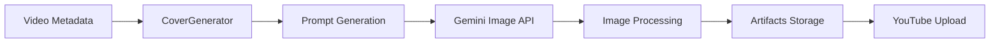

# Cover Image Generation

## Overview

The Cover Image Generation module provides AI-powered YouTube thumbnail creation using Google Gemini 2.5 Flash Image API. It supports multiple style variations, custom prompts, and integrates seamlessly with the artifacts system.

## Architecture



## Features

### 1. Multiple Style Templates

Built-in style templates for consistent thumbnail aesthetics:

- **Modern**: Minimalist design, bold typography, high contrast
- **Cinematic**: Movie poster style, dramatic lighting
- **Vibrant**: Colorful, energetic, eye-catching
- **Professional**: Clean business style, corporate colors
- **Creative**: Artistic, unique visual elements
- **Dark**: Moody atmosphere, dramatic shadows
- **Bright**: Cheerful, warm colors, inviting
- **Tech**: Futuristic neon accents, digital elements

### 2. Custom Prompts

Generate thumbnails with:
- Video title and description-based prompts
- Custom visual elements
- Brand-specific requirements
- User-provided reference images (future)

### 3. Batch Generation

Generate 1-4 cover variations in a single call for A/B testing.

### 4. High Quality Output

- 1280x720 pixels (YouTube standard 16:9)
- JPEG format (optimized for web)
- Professional-grade image quality
- No watermarks or branding

## API Reference

### CoverGenerator Class

#### Initialization

```python
from src.processors.cover_generator import CoverGenerator

# From environment variable
generator = CoverGenerator()

# With explicit API key
generator = CoverGenerator(api_key="your-api-key")
```

**Environment Variables:**
- `GOOGLE_GEMINI_API_KEY`: Required for API authentication

#### Methods

##### generate_covers()

Generate multiple cover image variations.

```python
paths = generator.generate_covers(
    title: str,
    description: Optional[str] = None,
    count: int = 4,
    styles: Optional[List[str]] = None,
    custom_prompts: Optional[List[str]] = None,
    output_dir: Optional[Path] = None,
    progress_callback: Optional[Callable] = None
) -> List[Path]
```

**Parameters:**
- `title`: Video title (main focus)
- `description`: Optional video description for context
- `count`: Number of covers to generate (1-4)
- `styles`: List of style names from STYLE_TEMPLATES
- `custom_prompts`: Override auto-generated prompts
- `output_dir`: Save location (default: `tmp/thumbnails/`)
- `progress_callback`: Function(current, total, message)

**Returns:**
List of Path objects pointing to generated images.

**Example:**

```python
# Generate 4 covers with default styles
paths = generator.generate_covers(
    title="10 Python Tips for Beginners",
    description="Learn essential Python programming tips",
    count=4
)

# Custom styles
paths = generator.generate_covers(
    title="Dark Mode UI Design",
    count=2,
    styles=['dark', 'tech']
)

# With progress tracking
def show_progress(current, total, msg):
    print(f"[{current}/{total}] {msg}")

paths = generator.generate_covers(
    title="My Video",
    progress_callback=show_progress
)
```

##### generate_prompt()

Generate AI prompt from video metadata.

```python
prompt = generator.generate_prompt(
    title: str,
    description: Optional[str] = None,
    style: str = 'modern',
    custom_elements: Optional[str] = None
) -> str
```

**Parameters:**
- `title`: Video title
- `description`: Video description (truncated to 200 chars)
- `style`: Style name or custom style description
- `custom_elements`: Additional visual requirements

**Returns:**
Complete text prompt for image generation.

**Example:**

```python
prompt = generator.generate_prompt(
    title="Amazing Python Tutorial",
    style="cinematic",
    custom_elements="robot in background, blue tones"
)
print(prompt)
```

##### get_available_styles()

Get list of available style templates.

```python
styles = generator.get_available_styles()
# ['modern', 'cinematic', 'vibrant', 'professional', ...]
```

## CLI Usage

The module includes a command-line interface for standalone use:

### Generate Covers

```bash
# Basic usage
python -m src.processors.cover_generator "My Video Title"

# With description
python -m src.processors.cover_generator \
  "Python Tutorial" \
  --description "Learn Python basics" \
  --count 4

# Custom styles
python -m src.processors.cover_generator \
  "Dark Mode UI" \
  --styles dark tech \
  --count 2 \
  --output ./my_thumbnails

# List available styles
python -m src.processors.cover_generator --list-styles
```

### CLI Options

- `title` (positional): Video title
- `-d, --description`: Video description
- `-c, --count`: Number of covers (1-4, default: 4)
- `-s, --styles`: Space-separated style names
- `-o, --output`: Output directory path
- `--list-styles`: Show all available styles and exit

## Integration

### With Artifacts System

```python
from src.core.artifacts import ArtifactsManager
from src.processors.cover_generator import CoverGenerator

# Initialize
artifacts = ArtifactsManager(project_dir="./my_project")
generator = CoverGenerator()

# Generate covers
paths = generator.generate_covers(
    title="My Video",
    count=4,
    output_dir=artifacts.get_artifact_dir('thumbnails')
)

# Save to artifacts
for i, path in enumerate(paths):
    artifacts.save_artifact(
        'thumbnails',
        f'thumbnail_{i+1}',
        path,
        metadata={'style': 'auto-generated', 'index': i+1}
    )
```

### With YouTube Uploader

```python
from src.processors.youtube_uploader import YouTubeUploader

# Generate thumbnail
generator = CoverGenerator()
covers = generator.generate_covers(title="My Video", count=4)

# Select best cover (e.g., first one)
selected_thumbnail = covers[0]

# Upload video with thumbnail
uploader = YouTubeUploader(...)
uploader.upload_video(
    video_file="video.mp4",
    metadata={
        'title': 'My Video',
        'description': 'Description',
        'tags': ['python', 'tutorial']
    },
    thumbnail_file=str(selected_thumbnail)
)
```

## Error Handling

### Common Errors

**ValueError: API key required**
- Cause: `GOOGLE_GEMINI_API_KEY` not set
- Solution: Set environment variable or pass `api_key` parameter

**ValueError: Cover count must be between 1 and 4**
- Cause: Invalid `count` parameter
- Solution: Use count between 1-4 (inclusive)

**RuntimeError: Gemini API request failed**
- Causes: Network error, API quota exceeded, invalid API key
- Solution: Check network, verify API key, check quota limits

**RuntimeError: No image data in API response**
- Cause: API returned unexpected format
- Solution: Check API status, verify prompt is valid

### Example Error Handling

```python
try:
    paths = generator.generate_covers(
        title="My Video",
        count=4
    )
except ValueError as e:
    print(f"Invalid parameters: {e}")
except RuntimeError as e:
    print(f"API error: {e}")
    # Retry with exponential backoff
    # Or fallback to default thumbnail
except Exception as e:
    print(f"Unexpected error: {e}")
    # Log error and use fallback
```

## Best Practices

### Prompt Engineering

1. **Keep titles concise** - Long titles may not fit on thumbnail
2. **Use descriptive styles** - Choose styles that match video tone
3. **Add context** - Include description for better relevance
4. **Test variations** - Generate 4 covers and A/B test

### Performance

1. **Batch generation** - Generate multiple covers in one call
2. **Cache results** - Save generated covers to avoid re-generation
3. **Use artifacts** - Integrate with artifacts system for organization
4. **Monitor quota** - Track API usage to avoid limits

### Quality Control

1. **Review generated covers** - Always manually check before upload
2. **Test readability** - Ensure text is readable at small sizes
3. **Brand consistency** - Use consistent styles across videos
4. **Mobile preview** - Test how thumbnails look on mobile devices

## API Quotas & Limits

### Gemini Image API Limits

- **Free tier**: 60 requests per minute
- **Image size**: Max 1280x720 pixels
- **File size**: ~200-500 KB per image (JPEG)
- **Rate limiting**: Exponential backoff recommended

### Recommendations

- Generate covers in batches during off-peak hours
- Cache generated covers in artifacts system
- Monitor API usage via Google Cloud Console
- Consider upgrading to paid tier for production use

## Testing

Run unit tests:

```bash
pytest tests/test_cover_generator.py -v
```

Test coverage:

```bash
pytest tests/test_cover_generator.py --cov=src.processors.cover_generator
```

## Troubleshooting

### Images not generating

1. **Check API key**: `echo $GOOGLE_GEMINI_API_KEY`
2. **Test API access**: `curl "https://generativelanguage.googleapis.com/v1beta/models?key=$GOOGLE_GEMINI_API_KEY"`
3. **Verify quota**: Check Google Cloud Console → APIs & Services → Quotas
4. **Check network**: Test internet connection

### Low quality images

- **Issue**: Blurry or pixelated thumbnails
- **Cause**: API compression settings
- **Solution**: Use JPEG quality parameter (future enhancement)

### Slow generation

- **Issue**: Takes >30 seconds per image
- **Cause**: API latency, network issues
- **Solution**: Generate during off-peak hours, use async requests

## Future Enhancements

Planned features:

- [ ] PNG format support (transparency)
- [ ] Custom aspect ratios (1:1, 4:3, vertical)
- [ ] Text overlay customization (font, color, position)
- [ ] Reference image upload (style transfer)
- [ ] Batch editing (apply changes to multiple covers)
- [ ] A/B testing analytics integration
- [ ] Thumbnail templates library
- [ ] Video frame extraction for cover base

## See Also

- [Artifacts System Documentation](artifacts-system.md)
- [YouTube Upload Integration](youtube-upload.md)
- [Video Processing Guide](video-processing.md)
- [Google Gemini Image API Docs](https://ai.google.dev/gemini-api/docs/image-generation)
