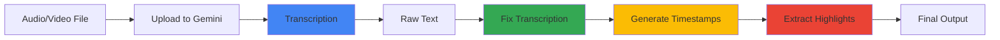

# Gemini API Transcription & Text Processing

## Overview

The `GeminiTranscriber` module provides cloud-based transcription using Google Gemini API with advanced text processing capabilities.

## Features

- **Cloud Transcription**: Upload audio/video files to Gemini API for transcription
- **AI Text Correction**: Fix punctuation, formatting, and errors automatically
- **Timestamp Generation**: Create timestamped segments for navigation
- **Highlight Extraction**: Identify and extract key moments from content
- **Progress Tracking**: Real-time progress updates for UI integration

## Architecture



## Installation

```bash
pip install google-generativeai
```

Set API key:
```bash
export GOOGLE_GEMINI_API_KEY="your_api_key_here"
```

## API Reference

### GeminiTranscriber

```python
from src.processors.gemini_transcriber import GeminiTranscriber

transcriber = GeminiTranscriber(
    api_key="your_api_key",          # Optional, reads from env
    model="gemini-2.5-flash",        # Model name
    progress_callback=callback_fn    # Optional progress updates
)
```

#### Parameters

- **api_key** (str, optional): Gemini API key. Falls back to `GOOGLE_GEMINI_API_KEY` env var
- **model** (str): Gemini model name (default: `gemini-2.5-flash`)
- **progress_callback** (callable, optional): `callback(progress: float, status: str)` for UI updates

### Methods

#### transcribe()

Transcribe audio/video file using Gemini API.

```python
transcription = transcriber.transcribe(
    audio_path=Path("video.mp4"),
    language="Russian",               # Optional language hint
    output_path=Path("transcript.txt")  # Optional save path
)
```

**Parameters:**
- `audio_path` (Path): Path to audio/video file
- `language` (str, optional): Language code for better accuracy
- `output_path` (Path, optional): Save transcription to file

**Returns:** Transcription text (str)

**Example:**
```python
text = transcriber.transcribe(
    audio_path=Path("podcast.mp3"),
    language="English"
)
print(text)
# Output: "Welcome to our podcast. Today we discuss..."
```

#### fix_transcription()

Fix transcription using AI (punctuation, formatting, error correction).

```python
fixed_text = transcriber.fix_transcription(
    text=raw_transcription,
    output_path=Path("transcript_fixed.txt")  # Optional
)
```

**What it fixes:**
- Adds punctuation (commas, periods, question marks)
- Fixes capitalization
- Corrects transcription errors
- Formats into paragraphs
- Removes excessive filler words

**Example:**
```python
raw = "hello this is a test um like you know it works great"
fixed = transcriber.fix_transcription(raw)
print(fixed)
# Output: "Hello, this is a test. It works great."
```

#### generate_timestamps()

Generate timestamped segments for transcription.

```python
timestamps = transcriber.generate_timestamps(
    audio_path=Path("video.mp4"),
    transcription=text,
    output_path=Path("timestamps.json")  # Optional
)
```

**Returns:** List of segments
```json
[
  {"start": 0.0, "end": 5.2, "text": "Welcome to the show."},
  {"start": 5.2, "end": 12.5, "text": "Today's topic is AI."}
]
```

**Example:**
```python
for segment in timestamps:
    print(f"[{segment['start']:.1f}s] {segment['text']}")
# Output:
# [0.0s] Welcome to the show.
# [5.2s] Today's topic is AI.
```

#### extract_highlights()

Extract key highlights from transcription.

```python
highlights = transcriber.extract_highlights(
    transcription=text,
    max_highlights=5,                # Number of highlights
    output_path=Path("highlights.json")  # Optional
)
```

**Returns:** List of highlights
```json
[
  {
    "timestamp": "00:15",
    "text": "The key insight is...",
    "reason": "Important conclusion"
  }
]
```

**Example:**
```python
for hl in highlights:
    print(f"[{hl['timestamp']}] {hl['text']}")
    print(f"  → Why: {hl['reason']}")
```

## CLI Usage

```bash
# Basic transcription
python -m src.processors.gemini_transcriber audio.mp3 -o transcript.txt

# With language hint
python -m src.processors.gemini_transcriber video.mp4 --language Russian -o output.txt

# Full pipeline (transcribe + fix + timestamps + highlights)
python -m src.processors.gemini_transcriber podcast.mp3 \
  -o transcript.txt \
  --fix \
  --timestamps \
  --highlights
```

**CLI Options:**
- `--api-key KEY`: Gemini API key
- `--model NAME`: Model name (default: gemini-2.5-flash)
- `--language LANG`: Language hint
- `-o, --output FILE`: Output file path
- `--fix`: Fix transcription after generation
- `--timestamps`: Generate timestamp segments
- `--highlights`: Extract key highlights

## Integration with Artifacts System

```python
from src.core.artifacts import ArtifactsManager
from src.processors.gemini_transcriber import GeminiTranscriber

# Initialize
artifacts = ArtifactsManager(project_path)
transcriber = GeminiTranscriber()

# Transcribe video
video_path = artifacts.get("main_video")
transcription = transcriber.transcribe(video_path)

# Save to artifacts
artifacts.save(
    "transcription_raw",
    transcription,
    metadata={"method": "gemini", "language": "auto"}
)

# Fix and save
fixed_text = transcriber.fix_transcription(transcription)
artifacts.save("transcription_fixed", fixed_text)

# Generate timestamps
timestamps = transcriber.generate_timestamps(video_path, transcription)
artifacts.save(
    "transcription_timestamps",
    json.dumps(timestamps, indent=2),
    metadata={"segments": len(timestamps)}
)
```

## Error Handling

```python
try:
    text = transcriber.transcribe(audio_path)
except ValueError as e:
    print(f"Configuration error: {e}")
except FileNotFoundError as e:
    print(f"File not found: {e}")
except RuntimeError as e:
    print(f"Transcription failed: {e}")
```

**Common Errors:**
- `ValueError`: API key missing
- `FileNotFoundError`: Audio file doesn't exist
- `RuntimeError`: API errors, upload failures, processing errors

## Performance

**Typical times** (varies by file size and API load):
- **Upload**: 5-30 seconds
- **Processing**: 10-60 seconds
- **Transcription**: 20-120 seconds
- **Fix/Timestamps/Highlights**: 5-15 seconds each

**Tips:**
- Use shorter files for faster processing
- Provide language hint for better accuracy
- Gemini API has quotas - check your usage
- Cache transcriptions to avoid re-processing

## Comparison: Gemini vs Whisper

| Feature | Gemini API | Whisper (Local) |
|---------|-----------|-----------------|
| **Speed** | Slower (upload + cloud) | Faster (local) |
| **Accuracy** | Excellent | Excellent |
| **Cost** | API calls | Free (uses local GPU/CPU) |
| **Languages** | 100+ | 99 |
| **Internet** | Required | Not required |
| **Setup** | API key only | Model download (1-1.5GB) |
| **Text Fixing** | Built-in AI | Manual |
| **Timestamps** | AI-generated | Word-level native |

**When to use Gemini:**
- Don't want to download models
- Need AI text correction
- Want cloud-based processing
- Internet connection available

**When to use Whisper:**
- Offline processing required
- Large volumes (cost-effective)
- Need precise word timestamps
- Local privacy concerns

## Best Practices

1. **API Key Security**: Never hardcode API keys, use environment variables
2. **File Size**: Keep files under 100MB for faster uploads
3. **Language Hints**: Provide language for better accuracy
4. **Error Handling**: Always wrap API calls in try/except
5. **Progress Callbacks**: Use callbacks for better UX in long operations
6. **Caching**: Save transcriptions to avoid re-processing
7. **Rate Limits**: Check Gemini API quotas for your project

## Troubleshooting

### "API key required" error
Set environment variable:
```bash
export GOOGLE_GEMINI_API_KEY="your_key"
```

### Upload timeout
- Check internet connection
- Try smaller file
- Split long videos into chunks

### Processing stuck at "PROCESSING"
- Wait up to 2 minutes
- Check file format (supported: MP3, WAV, MP4, M4A, OGG)
- Try re-uploading

### Poor transcription quality
- Provide language hint
- Check audio quality (noise, volume)
- Try `fix_transcription()` to improve

### JSON parsing errors in timestamps/highlights
- Gemini might wrap JSON in markdown (handled automatically)
- If errors persist, check raw response text

## See Also

- [Whisper Transcription](whisper-transcription.md) - Local transcription
- [Artifacts System](artifacts-system.md) - File management
- [Video Processing](video-processing.md) - Video operations
- [Gemini API Docs](https://ai.google.dev/gemini-api/docs) - Official Gemini documentation
