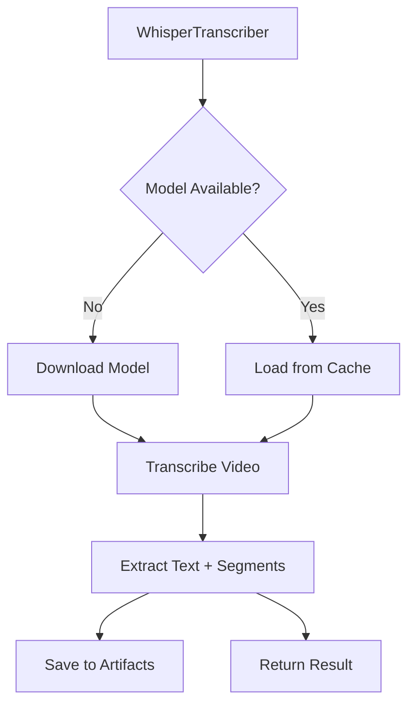

# Whisper Model Download & Transcription

Local video/audio transcription using OpenAI Whisper models.

## Features

- ✅ Automatic model download
- ✅ Progress tracking (UI-ready)
- ✅ 5 model sizes (tiny → large)
- ✅ Language auto-detection
- ✅ Word-level timestamps
- ✅ CLI for standalone use
- ✅ Artifacts System integration

## Architecture



## Model Sizes

| Model  | Size | RAM  | Speed    | Quality |
|--------|------|------|----------|---------|
| tiny   | 39MB | 1GB  | Fastest  | Basic   |
| **base** | 74MB | 1GB  | Fast     | Good    | ⭐ Default
| small  | 244MB| 2GB  | Medium   | Better  |
| medium | 769MB| 5GB  | Slow     | Great   |
| large  | 1.5GB| 10GB | Slowest  | Best    |

## Quick Start

```python
from src.processors.whisper_transcriber import WhisperTranscriber

# Create transcriber
transcriber = WhisperTranscriber(model="base")

# Transcribe video
result = transcriber.transcribe(
    video_path="video.mp4",
    language="en",  # Optional, auto-detect if None
    timestamps=True
)

print(result["text"])
print(f"Detected language: {result['language']}")
```

## API Reference

### WhisperTranscriber

```python
WhisperTranscriber(
    model: str = "base",
    models_dir: Optional[Path] = None,
    progress_callback: Optional[Callable[[float, str], None]] = None
)
```

**Parameters:**
- `model` - Model name: `tiny`, `base`, `small`, `medium`, `large`
- `models_dir` - Directory to store models (default: `~/.cache/whisper`)
- `progress_callback` - Callback function for progress updates: `callback(progress: float, status: str)`

### Methods

#### `is_model_available() -> bool`

Check if model is already downloaded.

```python
if not transcriber.is_model_available():
    print("Downloading model...")
    transcriber.download_model()
```

#### `get_model_info() -> Dict[str, Any]`

Get information about the selected model.

```python
info = transcriber.get_model_info()
print(f"Model: {info['name']}")
print(f"Size: {info['size_mb']} MB")
print(f"Available: {info['available']}")
```

**Returns:**
```python
{
    "name": "base",
    "size_mb": 74,
    "ram_gb": 1,
    "speed": "fast",
    "quality": "good",
    "available": True,
    "models_dir": "/home/user/.cache/whisper"
}
```

#### `download_model() -> bool`

Download Whisper model if not available.

```python
def progress_callback(progress: float, status: str):
    print(f"[{progress:.0f}%] {status}")

transcriber = WhisperTranscriber(
    model="small",
    progress_callback=progress_callback
)

if transcriber.download_model():
    print("Model ready!")
```

**Returns:** `True` on success, `False` on error

#### `transcribe(video_path, language=None, timestamps=True, output_path=None) -> Optional[Dict]`

Transcribe video or audio file.

```python
result = transcriber.transcribe(
    video_path="interview.mp4",
    language="ru",          # Optional
    timestamps=True,        # Include word timestamps
    output_path="transcript.txt"  # Optional
)
```

**Parameters:**
- `video_path` - Path to video/audio file
- `language` - Language code (`en`, `ru`, etc.) or `None` for auto-detect
- `timestamps` - Include word-level timestamps
- `output_path` - Save transcription to text file

**Returns:**
```python
{
    "text": "Full transcription text",
    "language": "en",
    "segments": [
        {
            "start": 0.0,
            "end": 2.5,
            "text": "First segment"
        },
        ...
    ],
    "model": "base"
}
```

#### `format_timestamps(segments: list) -> str`

Format segments with timestamps for display.

```python
result = transcriber.transcribe("video.mp4")
formatted = transcriber.format_timestamps(result["segments"])

print(formatted)
# Output:
# [00:00:00 -> 00:00:02] First segment
# [00:00:02 -> 00:00:05] Second segment
```

## Progress Callbacks

```python
def on_progress(progress: float, status: str):
    """
    progress: 0-100 (percentage)
    status: Human-readable status message
    """
    print(f"[{progress:5.1f}%] {status}")

transcriber = WhisperTranscriber(
    model="base",
    progress_callback=on_progress
)

# Progress updates:
# [  0.0%] Downloading base model (74 MB)...
# [ 30.0%] Transcribing...
# [ 90.0%] Processing results...
# [100.0%] Transcription complete!
```

## CLI Usage

The module includes a standalone CLI for testing:

```bash
# Show model info
python -m src.processors.whisper_transcriber --info --model base

# Transcribe video
python -m src.processors.whisper_transcriber video.mp4

# Specify model and output
python -m src.processors.whisper_transcriber video.mp4 \
    --model small \
    --output transcript.txt

# Force language
python -m src.processors.whisper_transcriber video.mp4 \
    --language ru

# Disable timestamps
python -m src.processors.whisper_transcriber video.mp4 \
    --no-timestamps
```

**CLI Options:**
- `--model` - Model to use (tiny/base/small/medium/large)
- `--language` - Language code or auto-detect
- `--output`, `-o` - Output file path
- `--no-timestamps` - Disable timestamp output
- `--info` - Show model info and exit

## Integration with Artifacts System

```python
from src.core.artifacts import ArtifactsManager
from src.processors.whisper_transcriber import WhisperTranscriber

# Setup
artifacts = ArtifactsManager("my_project")
transcriber = WhisperTranscriber(model="base")

# Transcribe
result = transcriber.transcribe(
    video_path=artifacts.get_artifact("final_video"),
    output_path=artifacts.get_path("transcription", "raw_transcription.txt")
)

# Save to artifacts
artifacts.save_artifact(
    "transcription",
    "raw_transcription.txt",
    metadata={
        "language": result["language"],
        "model": result["model"],
        "duration": result["segments"][-1]["end"] if result["segments"] else 0
    }
)
```

## Language Support

Whisper supports 99 languages. Common codes:

- `en` - English
- `ru` - Russian
- `es` - Spanish
- `fr` - French
- `de` - German
- `zh` - Chinese
- `ja` - Japanese
- `ko` - Korean

**Auto-detection:** Set `language=None` (default) to detect automatically.

## Error Handling

```python
import logging

logging.basicConfig(level=logging.INFO)

try:
    result = transcriber.transcribe("video.mp4")
    if result:
        print(result["text"])
    else:
        print("Transcription failed")
except FileNotFoundError:
    print("Video file not found")
except Exception as e:
    print(f"Error: {e}")
```

## Performance Tips

1. **Choose the right model:**
   - `tiny` - Quick tests, low-quality content
   - `base` - Good balance for most use cases ⭐
   - `small` - Better quality for important content
   - `medium/large` - Professional transcription

2. **Use language parameter:**
   ```python
   # Faster when you know the language
   result = transcriber.transcribe("video.mp4", language="en")
   ```

3. **Disable timestamps if not needed:**
   ```python
   result = transcriber.transcribe("video.mp4", timestamps=False)
   ```

4. **Cache models:**
   - Models are cached in `~/.cache/whisper` by default
   - First download is slow, subsequent uses are instant

## Troubleshooting

### Model download fails

```python
# Use custom directory with write permissions
transcriber = WhisperTranscriber(
    model="base",
    models_dir=Path("./my_models")
)
```

### Out of memory errors

```bash
# Use smaller model
transcriber = WhisperTranscriber(model="tiny")  # Only 1GB RAM needed
```

### Slow transcription

- Use smaller model (`tiny` or `base`)
- Disable timestamps if not needed
- Consider using Gemini API Transcription for cloud processing

## Testing

Run unit tests:

```bash
cd video-studio
source venv/bin/activate
python -m pytest tests/test_whisper_transcriber.py -v
```

Run integration tests (requires actual Whisper):

```bash
# Install Whisper first
pip install openai-whisper

# Run integration tests
python -m pytest tests/test_whisper_transcriber.py -v -m integration
```

## Dependencies

```bash
pip install openai-whisper
```

**Note:** Whisper requires `ffmpeg` to be installed on the system:

```bash
# Ubuntu/Debian
sudo apt install ffmpeg

# macOS
brew install ffmpeg

# Windows
# Download from https://ffmpeg.org/
```

## See Also

- [Gemini API Transcription](./gemini-transcription.md) - Cloud alternative
- [Artifacts System](./artifacts-system.md) - File management
- [Audio Cleanup](./audio-cleanup.md) - Pre-processing
