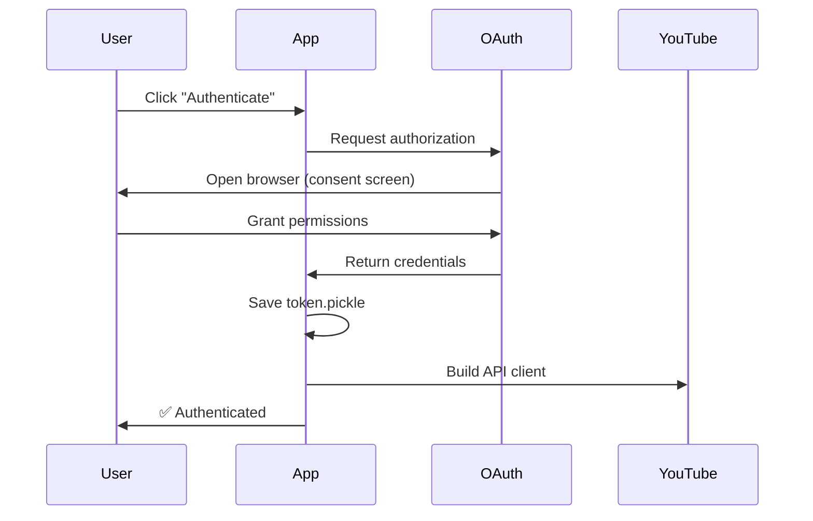
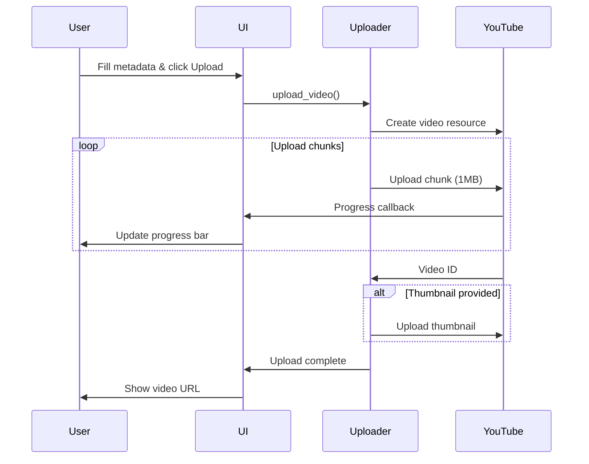

# YouTube Upload Integration

## Overview

The YouTube Upload module provides OAuth2-authenticated video uploading to YouTube using the YouTube Data API v3.

## Architecture

### Components

1. **YouTubeUploader** (`src/processors/youtube_uploader.py`)
   - Core upload logic
   - OAuth2 authentication handling
   - API interaction

2. **YouTubePanel** (`src/ui/youtube_panel.py`)
   - UI for upload configuration
   - Metadata input forms
   - Progress tracking

### Authentication Flow



### Upload Flow



## Setup

### 1. Google Cloud Console Setup

1. Go to [Google Cloud Console](https://console.cloud.google.com/)
2. Create a new project (or select existing)
3. Enable **YouTube Data API v3**:
   - Navigate to "APIs & Services" → "Library"
   - Search "YouTube Data API v3"
   - Click "Enable"

4. Create OAuth2 credentials:
   - Go to "APIs & Services" → "Credentials"
   - Click "Create Credentials" → "OAuth client ID"
   - Application type: **Desktop app**
   - Name: "Video Studio"
   - Download JSON file

5. Configure OAuth consent screen:
   - User type: External (for testing)
   - Add test users if needed
   - Scopes: `youtube.upload`, `youtube`

### 2. Application Setup

1. Place downloaded JSON file in project:
   ```bash
   cp ~/Downloads/client_secret_*.json config/youtube_credentials.json
   ```

2. Add to `.env`:
   ```bash
   YOUTUBE_CREDENTIALS_PATH=config/youtube_credentials.json
   ```

3. First run will open browser for authorization
4. Token saved to `token.pickle` (gitignored)

## Usage

### Programmatic Upload

```python
from src.processors.youtube_uploader import YouTubeUploader

# Initialize uploader
uploader = YouTubeUploader(
    credentials_path="config/youtube_credentials.json"
)

# Authenticate (opens browser first time)
if uploader.authenticate():
    
    # Upload video
    result = uploader.upload_video(
        video_path="output/final_video.mp4",
        title="My Awesome Video",
        description="Full description here",
        tags=["tech", "tutorial", "education"],
        category_id="28",  # Science & Technology
        privacy_status="unlisted",  # public, unlisted, private
        thumbnail_path="output/thumbnail.jpg",
        progress_callback=lambda uploaded, total: print(f"{uploaded/total*100:.0f}%")
    )
    
    if result:
        print(f"✅ Video ID: {result['id']}")
        print(f"🔗 URL: {result['url']}")
```

### GUI Upload

1. Open Video Studio
2. Navigate to "YouTube Upload" panel
3. Click "Select credentials.json" → choose OAuth file
4. Click "Authenticate" → browser opens
5. Grant permissions → return to app
6. Fill metadata:
   - Title (required)
   - Description
   - Tags (comma-separated)
   - Privacy setting
   - Category
   - Thumbnail (optional)
7. Click "Upload to YouTube"
8. Wait for progress bar completion
9. Copy video URL from success dialog

## API Reference

### YouTubeUploader Class

#### `__init__(credentials_path, token_path='token.pickle')`

Initialize uploader with OAuth credentials.

**Args:**
- `credentials_path` (str): Path to `client_secret_*.json` file
- `token_path` (str): Where to save authentication token

#### `authenticate() -> bool`

Authenticate with YouTube API using OAuth2.

**Returns:**
- `True` if successful, `False` otherwise

**Behavior:**
- First run: Opens browser for user consent
- Subsequent runs: Loads saved token
- Auto-refreshes expired tokens

#### `upload_video(...) -> Optional[Dict]`

Upload video with metadata.

**Args:**
- `video_path` (str): Path to video file
- `title` (str): Video title (max 100 chars)
- `description` (str): Description (max 5000 chars, optional)
- `tags` (List[str]): Tag list (max 500 chars total, optional)
- `category_id` (str): Category ID (default: "22" = People & Blogs)
- `privacy_status` (str): "public", "unlisted", or "private"
- `thumbnail_path` (str): Thumbnail image path (optional)
- `progress_callback` (callable): Progress function (optional)

**Returns:**
- Dict with keys: `id`, `url`, `title`, `status`
- `None` if upload fails

**Example:**
```python
result = uploader.upload_video(
    video_path="video.mp4",
    title="Test Video",
    privacy_status="unlisted"
)
# → {'id': 'dQw4w9WgXcQ', 'url': 'https://youtube.com/watch?v=...', ...}
```

#### `upload_thumbnail(video_id, thumbnail_path) -> bool`

Upload custom thumbnail for existing video.

**Args:**
- `video_id` (str): YouTube video ID
- `thumbnail_path` (str): Image path (JPG/PNG, max 2MB)

**Returns:**
- `True` if successful, `False` otherwise

**Constraints:**
- Max size: 2MB
- Format: JPG or PNG
- Recommended: 1280x720 (16:9)

#### `get_upload_status(video_id) -> Optional[Dict]`

Check video processing status.

**Args:**
- `video_id` (str): YouTube video ID

**Returns:**
- Dict with keys: `uploadStatus`, `privacyStatus`, `processingStatus`
- `None` if request fails

### Category IDs

| Category | ID |
|----------|-----|
| Film & Animation | 1 |
| Autos & Vehicles | 2 |
| Music | 10 |
| Pets & Animals | 15 |
| Sports | 17 |
| Gaming | 20 |
| People & Blogs | 22 |
| Comedy | 23 |
| Entertainment | 24 |
| Education | 27 |
| Science & Technology | 28 |

## Integration with Workflow

The YouTube upload step integrates with the artifacts system:

1. **Prerequisites:**
   - Artifact: `final_video` (processed video file)
   - Artifact: `thumbnail` (optional, generated by Cover module)
   - Artifact: `final_title` (optional, from Title Generator)

2. **Workflow Position:**
   ```
   Video Processing → Audio Cleanup → Transcription
   → Title Generation → Cover Generation → **YouTube Upload**
   ```

3. **Auto-populate Metadata:**
   - Title: Load from `final_title` artifact
   - Thumbnail: Load from `thumbnail` artifact
   - Description: Template with video stats

4. **Post-upload Artifacts:**
   - Save: `youtube_video_id`
   - Save: `youtube_url`
   - Save: `upload_metadata.json`

## Error Handling

### Common Errors

| Error | Cause | Solution |
|-------|-------|----------|
| `FileNotFoundError: credentials` | OAuth file missing | Download from Cloud Console |
| `Invalid credentials` | Wrong JSON format | Re-download OAuth credentials |
| `Quota exceeded` | API daily limit hit | Wait 24h or request quota increase |
| `Invalid thumbnail size` | Image > 2MB | Resize/compress image |
| `Upload failed: 401` | Token expired | Re-authenticate (delete token.pickle) |
| `Upload failed: 403` | API not enabled | Enable YouTube Data API v3 |

### Retry Logic

The uploader implements automatic retry for:
- Network timeouts (3 retries)
- Resumable upload chunks (automatic)
- Expired token refresh (automatic)

### Logging

Enable debug logging:

```python
import logging
logging.basicConfig(level=logging.DEBUG)

uploader = YouTubeUploader(...)
# Now see detailed API calls
```

## Security

### Credentials Storage

- **DO NOT** commit `client_secret_*.json` to git
- **DO NOT** commit `token.pickle` to git
- Add to `.gitignore`:
  ```
  config/youtube_credentials.json
  token.pickle
  *.pickle
  ```

### Token Encryption

For production deployment, encrypt `token.pickle`:

```python
from cryptography.fernet import Fernet

# Generate key (save securely)
key = Fernet.generate_key()
cipher = Fernet(key)

# Encrypt token
with open('token.pickle', 'rb') as f:
    encrypted = cipher.encrypt(f.read())

with open('token.enc', 'wb') as f:
    f.write(encrypted)
```

### Scopes

Minimum required scopes:
- `https://www.googleapis.com/auth/youtube.upload` (upload videos)
- `https://www.googleapis.com/auth/youtube` (set thumbnails)

**Never** request more scopes than needed.

## Testing

### Unit Tests

```bash
# Run YouTube uploader tests
pytest tests/test_youtube_uploader.py -v
```

### Manual Testing

1. **Auth Test:**
   ```bash
   python src/processors/youtube_uploader.py config/credentials.json test_video.mp4 "Test Upload"
   ```

2. **UI Test:**
   - Run app: `python src/main.py`
   - Navigate to YouTube panel
   - Test authentication flow
   - Test upload with minimal metadata

### Test Videos

Use short test videos (< 10MB) to avoid quota consumption:

```bash
# Generate 10s test video
ffmpeg -f lavfi -i testsrc=duration=10:size=1280x720:rate=30 \
       -f lavfi -i sine=frequency=1000:duration=10 \
       -pix_fmt yuv420p test_video.mp4
```

## Quotas & Limits

### API Quotas

YouTube Data API v3 default quotas (per day):
- **Queries:** 10,000 units/day
- **Video upload:** 1,600 units (can upload ~6 videos/day)

**Cost per operation:**
- `videos.insert`: 1,600 units
- `thumbnails.set`: 50 units
- `videos.list`: 1 unit

### Request Quota Increase

If you need higher limits:
1. Go to [Quota page](https://console.cloud.google.com/apis/api/youtube.googleapis.com/quotas)
2. Click "Edit Quotas"
3. Request increase with justification

### File Limits

- Video size: **256 GB** (or 12 hours, whichever is less)
- Thumbnail: **2 MB**
- Title: **100 characters**
- Description: **5,000 characters**
- Tags: **500 characters** total

## Troubleshooting

### Browser doesn't open for OAuth

**Cause:** Running in headless environment

**Solution:**
1. Copy authorization URL from console
2. Open on local machine
3. Complete auth
4. Copy token.pickle back to server

### "Upload completed" but video not visible

**Cause:** Video still processing

**Check status:**
```python
status = uploader.get_upload_status(video_id)
print(status['processingStatus'])  # "processing" | "succeeded" | "failed"
```

### High-resolution processing takes long

**Explanation:** YouTube processes multiple qualities (360p, 720p, 1080p, 4K) sequentially. Higher resolutions appear later.

**Timeline:**
- 360p: ~5 minutes
- 720p: ~10 minutes
- 1080p: ~30 minutes
- 4K: ~1 hour

## References

- [YouTube Data API v3 Docs](https://developers.google.com/youtube/v3)
- [OAuth2 for Desktop Apps](https://developers.google.com/identity/protocols/oauth2/native-app)
- [Video Upload API](https://developers.google.com/youtube/v3/guides/uploading_a_video)
- [Resumable Upload](https://developers.google.com/youtube/v3/guides/using_resumable_upload_protocol)
